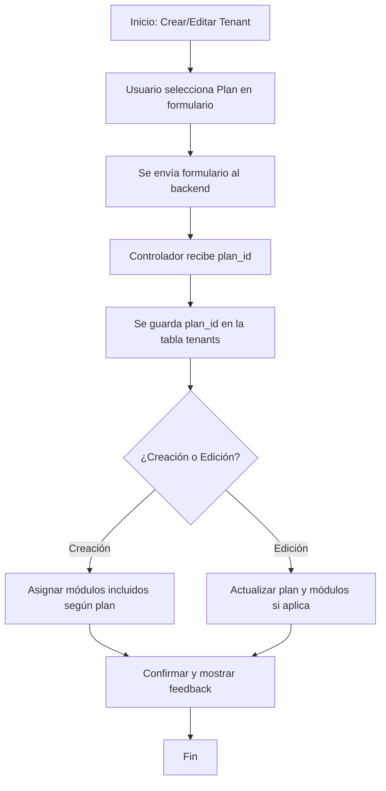

# 📊 Flujo de Asignación de Planes a Tenants

---

## Descripción del Flujo

1. **Inicio:** El usuario accede al formulario para crear o editar un tenant.
2. **Selección de Plan:** El usuario elige un plan de suscripción disponible en el select del formulario.
3. **Envío:** Al guardar, el formulario envía el `plan_id` seleccionado al backend.
4. **Backend:** El controlador recibe el `plan_id` y lo almacena en la tabla `tenants`.
5. **Asignación de módulos:**
   - Si es creación, se asignan automáticamente los módulos incluidos en el plan.
   - Si es edición, se actualiza el plan y se pueden ajustar los módulos según la lógica definida.
6. **Feedback:** El sistema muestra confirmación visual (SweetAlert2) y registra la acción en auditoría.
7. **Fin:** El tenant queda registrado/actualizado con el plan asignado.

---

## Notas
- El menú lateral ahora incluye acceso directo a la administración de planes.
- El flujo es válido tanto para la creación como para la edición de tenants.
- Los módulos incluidos pueden variar según el plan seleccionado.
- Toda acción relevante queda registrada en logs y auditoría.
